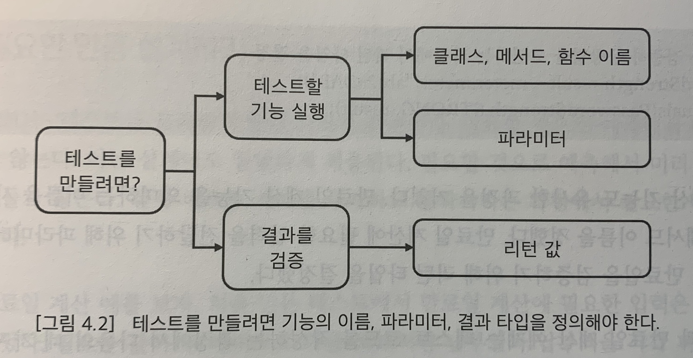

# CHAPTER 4 — TDD・기능 명세・설계

## 기능 명세
- 기능을 구현하려면 다음의 2가지가 필요하다.
    - '입력'
        - 기능을 실행하는 데 필요한 값
        - 보통 메서드의 파라미터로 전달
    - '결과'
        - ex) 리턴 값
        - (조회뿐만 아니라) 변경도 결과에 포함 (테스트 대상을 실행한 뒤에는 해당 데이터를 조회해서 올바르게 변경이 수행되었는지 확인할 수 있다)
- 설계는 기능 명세로부터 시작한다.
    - 기능 명세를 구체화하는 동안 입력과 결과를 도출하고, 그것을 코드에 반영한다.
    - 입력과 결과를 코드에 반영하는 과정에서 기능의 이름, 파라미터, 리턴 타입 등이 결정된다.
    - **이는 곧 기능에 대한 설계 과정과 연결된다**.

## 설계 과정을 지원하는 TDD
- TDD는 테스트 코드를 먼저 만든다.
- 테스트 코드를 먼저 만들기 위해 무엇이 필요할까? 다음의 2가지를 할 수 있어야 한다.
    - 테스트할 기능을 실행
        - 즉 테스트에서 실행할 수 있는 객체나 함수가 존재해야 한다.
        - 테스트 대상이 되는 클래스와 메서드의 이름을 결정해야 한다.
        - 인자의 타입과 개수를 결정해야 한다.
    - 실행 결과를 검증
        - 실행결과를 어떻게 검증할 수 있는지 고민해야 한다(ex. 리턴 타입을 무엇으로?).

    
- 즉 테스트 코드를 작성하는 과정에서 다음의 4가지를 결정하게 된다.
    - 클래스 이름
    - 메서드 이름
    - 메서드 파라미터
    - 실행 결과
- **이것을 고민하는 과정은 곧 설계 과정이다**.
    - TDD에서 테스트 코드를 작성할 때 고민하는 것과, 설계 과정에서 고민하는 것은 공통 분모가 있다.
    - (TDD 자체가 설계는 아니지만) **TDD를 하다 보면 테스트 코드를 작성하는 과정에서 일부 설계를 진행하게 된다**.
- TDD는 테스트를 통과할 만큼만 코드를 작성한다
    - 필요할 것으로 예측해서 미리 코드를 만들지 않는다. 테스트 사례를 추가하고 통과시키는 과정에서 필요한 만큼 설계를 변경한다.
- TDD로 개발하면 현재의 테스트를 통과시키는 데 필요한 만큼의 코드만 만들게 된다.
    - TDD로 개발하는 코드 비율이 높아질 수록, 지금 시점에서 필요한 설계만 코드에 반영할 가능성이 커진다.

## 기능 명세 구체화
- 테스트 코드를 작성하려면 파라미터와 결과 값을 정해야 하므로, 개발자는 요구사항 문서에서 기능 명세를 정리(기능의 입력과 결과를 도출)해야 한다.
- 테스트 코드는 예시를 이용한 구체적인 명세가 된다.
    - 구체적인 예는 개발자가 요구사항을 더 잘 이해할 수 있게 만든다.
- 테스트 코드는 (구체적인 예를 이용해서) 바로 실행할 수 있다.
    - 특정 상황에서 코드가 어떻게 동작하는지 이해하고 싶다면, 해당 상황을 검증하는 테스트 코드를 실행하고 해당 기능 코드를 추적하면 된다.